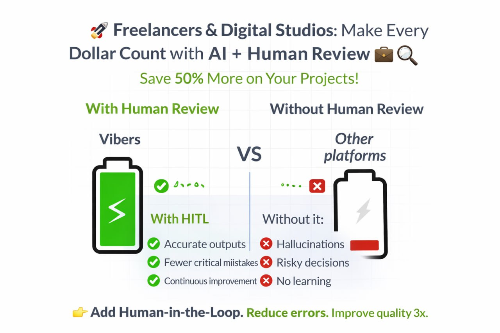
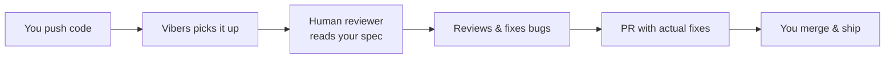

<p align="center">
  
</p>

<h1 align="center">Vibers — Human-in-the-Loop Code Review</h1>

<p align="center">
  <strong>AI writes the code. We check if it actually works.</strong>
</p>

<p align="center">
  <a href="https://github.com/marsiandeployer/human-in-the-loop-review/stargazers"></a>
  <a href="https://github.com/marsiandeployer/human-in-the-loop-review/blob/main/LICENSE"></a>
  <a href="https://github.com/marsiandeployer/human-in-the-loop-review/issues"></a>
  <a href="https://github.com/marsiandeployer/human-in-the-loop-review/pulls"></a>
  <a href="https://github.com/apps/vibers-review/installations/new"></a>
</p>

<p align="center">
  <a href="https://onout.org/vibers/">Website</a> &bull;
  <a href="https://onout.org/vibers/blog/">Blog</a> &bull;
  <a href="https://onout.org/vibers/SKILL.md">AI Agent Skill</a> &bull;
  <a href="https://t.me/VibersReview">Telegram</a> &bull;
  <a href="https://www.reddit.com/r/VibeCodeReview">Reddit</a>
</p>

---

You vibe code fast with Cursor, Copilot, or Claude Code. Then spend 3x longer debugging things you didn't write.

**Vibers** puts a human in the loop. We review your AI-generated code, catch the bugs AI misses, fix them, and send you a PR. You merge and keep shipping.

> **Honest about what this is:** We're not a security firm. No OWASP pentests, no architecture deep-dives. We're regular devs who review your code with fresh eyes — catch obvious bugs, check that main flows work, write the fix. Think alpha tester who sends a PR instead of filing a ticket.

## Quick Start (30 seconds)

### Option A: AI Agent (recommended)

Tell your AI coding agent:

```
Install skill from https://onout.org/vibers/SKILL.md
```

Works with Claude Code, Cursor, Windsurf, and Codex.

### Option B: GitHub App (one click)

[](https://github.com/apps/vibers-review/installations/new)

1. Click the button above
2. Select your repositories
3. Push code with a "How to test" section in your commit message
4. Get a PR with fixes within 24 hours

### Option C: GitHub Action

```yaml
name: Vibers Review
on: [push]
jobs:
  review:
    runs-on: ubuntu-latest
    steps:
      - uses: actions/checkout@v4
      - uses: marsiandeployer/vibers-action@v1.1
        with:
          spec_url: 'https://docs.google.com/document/d/YOUR_SPEC'
          telegram_contact: '@your_telegram'
```

## What We Catch

| Category | What we look for |
|----------|-----------------|
| **Spec compliance** | Does the code actually do what you described in your spec? |
| **AI hallucinations** | Fake APIs, non-existent imports, fabricated npm packages |
| **Logic bugs** | Edge cases, null handling, off-by-one errors, broken flows |
| **UI/UX issues** | Broken layouts, missing loading states, wrong behavior |
| **Security gaps** | Hardcoded secrets, open CORS, missing auth checks |

## How It Works

```
You push code → Vibers notifies reviewer → Human reviews against your spec → PR with fixes → You merge
```



## Real Review Example

Here's a real PR we sent to [MethasMP/Paycif](https://github.com/MethasMP/Paycif) — a payment gateway from Thailand:

> **[PR #2: Bug fixes and improvements](https://github.com/MethasMP/Paycif/pull/2)** — Found 5 bugs including broken payment flow, missing error handling, and UI issues. All fixed with working code.

This is what every review looks like: not just comments, but actual working fixes in a PR.

## Vibers vs Alternatives

| Feature | Vibers | CodeRabbit | SonarQube | PullRequest.com |
|---------|--------|------------|-----------|-----------------|
| Reads your spec | Yes | No | No | Partial |
| Sends PRs with fixes | Yes | No (comments only) | No | No |
| Catches AI hallucinations | Yes | Partial | No | Yes |
| Tests live app | Yes | No | No | No |
| Setup time | 30 seconds | 5 min | Hours | Days |
| Free tier | Yes | Limited | Community | No |

## Pricing

| Plan | Price | Details |
|------|-------|---------|
| **Promo** | Free | Star this repo + share feedback. We review, fix, send a PR. |
| **Standard** | $15/hour | Priority turnaround, full spec review. Pay only for hours spent. |

No subscriptions. No contracts. No minimums.

## Who It's For

- **Solo founders** who vibecoded an MVP and want a sanity check before launch
- **Non-technical founders** who have a spec but can't read the code themselves
- **AI-first teams** where most code is AI-generated and nobody's reviewing it
- **Open source maintainers** getting AI-generated PRs they can't fully trust

## Community

- [Telegram Channel](https://t.me/VibersReview) — updates and case studies
- [Reddit r/VibeCodeReview](https://www.reddit.com/r/VibeCodeReview) — discussions and teardowns
- [Blog](https://onout.org/vibers/blog/) — articles on AI code quality, vibe coding, and review practices

## FAQ

<details>
<summary><b>Do I need to share my spec?</b></summary>
Nope — it's optional. We read the code and figure out context. But a spec means faster, more targeted reviews.
</details>

<details>
<summary><b>What languages do you support?</b></summary>
JS/TS, Python, React, Next.js, Node.js, Django, Flask, Go. If it's on GitHub, we can review it.
</details>

<details>
<summary><b>How fast is the turnaround?</b></summary>
Within 24 hours. Standard plan gets priority.
</details>

<details>
<summary><b>What if I disagree with a fix?</b></summary>
Comment on the PR. We discuss, adjust, or explain. It's a conversation, not a decree.
</details>

<details>
<summary><b>Can you review private repos?</b></summary>
Yes. When you install the GitHub App, you choose which repos to share — including private ones. We only see what you explicitly allow.
</details>

<details>
<summary><b>No GitHub?</b></summary>
<a href="https://t.me/onoutnoxon">Write us on Telegram</a> and send your code + spec directly.
</details>

## Contributing

We welcome contributions! See [CONTRIBUTING.md](CONTRIBUTING.md) for guidelines.

Found a bug? [Open an issue](https://github.com/marsiandeployer/human-in-the-loop-review/issues/new).

## License

This project is licensed under the MIT License — see the [LICENSE](LICENSE) file for details.

---

<p align="center">
  <b>If this sounds useful — a star helps others find the project!</b>
</p>

<p align="center">
  <a href="https://github.com/marsiandeployer/human-in-the-loop-review"></a>
</p>

<p align="center">
  <a href="https://star-history.com/#marsiandeployer/human-in-the-loop-review&Date">
    
  </a>
</p>
